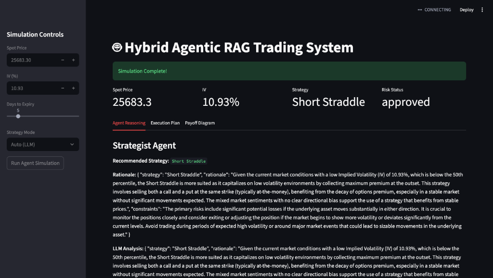
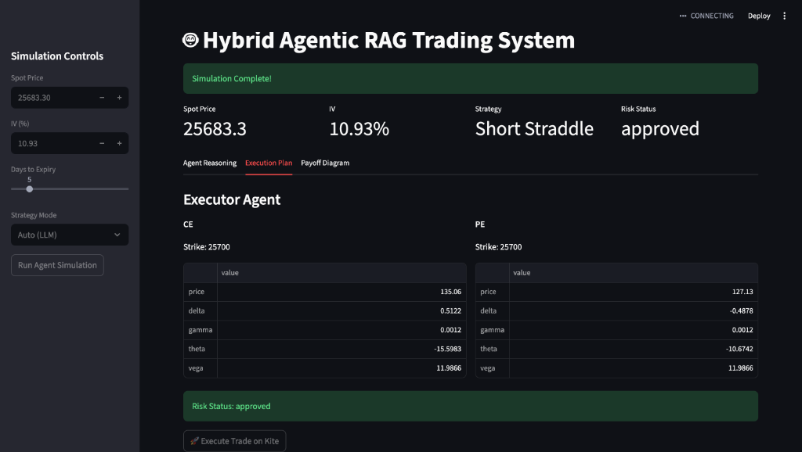
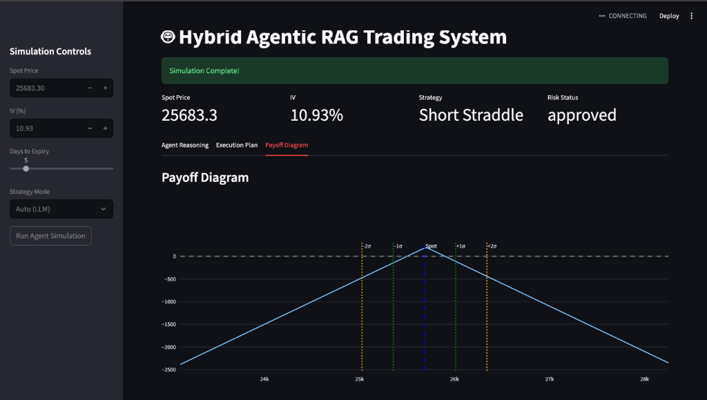

# 🤖 Hybrid Agentic RAG Trading System

An autonomous trading system that combines **Agentic AI** with **Retrieval-Augmented Generation (RAG)** to execute sigma-based option selling strategies (Strangles & Straddles) on the Indian Market (Nifty 50).

---

## 🚀 Key Features

*   **Hybrid Multi-Model Intelligence**: Orchestrates specialized LLMs for different tasks to reduce bias and improve performance:
    *   **OpenAI GPT-4**: For high-precision strategy selection and rigid rule synthesis.
    *   **Llama 3 (via Groq)**: For high-speed market research synthesis and risk auditing ("Second Opinion").
*   **RAG-Powered Strategy**: Retrieves strategy rules and constraints from a knowledge base (PDFs/Docs) rather than hardcoded logic.
*   **Multi-Agent Architecture**: Discrete agents for Research, Strategy, Execution, and Risk Management orchestrated via **LangGraph**.
*   **Real-Time Data**:
    *   **Spot Price**: Live Nifty 50 from `yfinance`.
    *   **Volatility**: Live India VIX from `yfinance`.
    *   **Execution**: Real-time order placement via **Zerodha Kite Connect**.
*   **Interactive Dashboard**: A text-to-insight UI built with **Streamlit** for monitoring agents, validating Greeks, and manual overrides.

---

## 🧠 System Architecture

The system operates as a **Directed Acyclic Graph (DAG)** where state is passed between agents.

### 1. The Workflow
1.  **Market Scanner**: Fetches live Nifty Spot (`^NSEI`) and India VIX (`^INDIAVIX`). Checks key entry conditions (Time, Volatility).
2.  **Market Researcher**:
    *   **Scrapes** live headlines from MoneyControl, MarketWatch, and Google using `googlesearch-python` and `BeautifulSoup`.
    *   **Synthesizes** a market sentiment report using **Llama 3 (via Groq)**.
3.  **Position Monitor**: Continually analyzes open positions using **Llama 3** to detect if news or price logic requires an "Adjustment" (Roll/Hedge) or "Exit".
4.  **Strategist (The Brain)**:
    *   Queries **ChromaDB** (Vector Store) for *Strategy Rules* (e.g., "Short Strangle Entry Criteria").
    *   Synthesizes Market Data + Sentiment + Rules using **OpenAI GPT-4**.
    *   Decides: *Short Strangle* vs *Short Straddle* with strict JSON-based reasoning.
5.  **Executor (The Hands)**:
    *   Calculates exact Strike Prices based on Sigma (Standard Deviation) bounds.
    *   Generates the Order Plan (Legs, Quantity, Order Type).
6.  **Risk Manager (The Reviewer)**:
    *   Acts as a "Second Opinion" auditor using **Llama 3**.
    *   Validates the proposed order against safety checks (Margin, Delta Exposure, Event Risk).
    *   **Approves** or **Rejects** the trade based on independent reasoning.

---

## 📚 How RAG Works Here

Instead of hardcoding "Sell 15 Delta Strangle", we store strategy PDFs in `data/`.
1.  **Ingestion**: PDFs are chunked and embedded into a Vector Database.
2.  **Retrieval**: The `Strategist` agent asks *"What are the rules for High IV environments?"*.
3.  **Generation**: The LLM reads the retrieved paragraphs and decides the best course of action.

This allows you to update strategy behavior simply by **uploading a new PDF**, without changing code.

---

## 🛠️ Agents & Modules

| Agent / Module | Role | File Check |
| :--- | :--- | :--- |
| **Market Scanner** | Data Ingestion | `src/integration/yfinance_client.py` |
| **Strategist** | Decision Maker (LLM + RAG) | `src/agents/strategist.py` |
| **Executor** | Quant Math & Order Gen | `src/agents/executor.py` |
| **Risk Manager** | Compliance & Safety | `src/agents/risk_manager.py` |
| **Quant Engine** | Black-Scholes & Greeks | `src/quant_engine/sigma_calculator.py` |
| **Kite App** | Broker Integration | `src/integration/kite_app.py` |

---

## ⚙️ Installation & Setup

1.  **Install Dependencies**
    ```bash
    uv pip install -r requirements.txt
    ```

2.  **Configuration**
    Create a `.env` file in the root directory:
    ```env
    OPENAI_API_KEY=sk-xxxx
    GROQ_API_KEY=gsk_xxxx
    KITE_API_KEY=xxxx
    KITE_API_SECRET=xxxx
    KITE_REDIRECT_URL=http://localhost:8000/callback
    ```

3.  **Zerodha Login (Daily)**
    Generate a fresh access token each morning:
    ```bash
    python get_access_token.py
    ```
    *Copy the generated token back into `.env` as `KITE_ACCESS_TOKEN`.*

4.  **Run the Dashboard**
    ```bash
    streamlit run src/ui/dashboard.py
    ```

---

## 📊 Dashboard Usage

*   **Strategy Mode**: Choose **Auto** (let Agent decide) or force **Strangle/Straddle**.
*   **Payoff Diagram**: Visualizes the P&L zone.
    *   **Green Lines**: 1-Sigma Range (68% probability).
    *   **Orange Lines**: 2-Sigma Range (95% probability).
*   **Execute Button**: One-click execution to send orders to Zerodha.

---

## 📸 Interface Preview

### Strategist Agent

*The Strategist Agent analyzes market data and selects the optimal strategy (e.g., Short Straddle) with detailed rationale.*

### Executor Plan & Greeks

*The Executor Agent calculates precise strike prices and Greeks (Delta, Theta, Vega) before execution.*

### Interactive Payoff Diagram

*Real-time visualization of the strategy's payoff curve with 1-Sigma and 2-Sigma safety ranges.*

---
